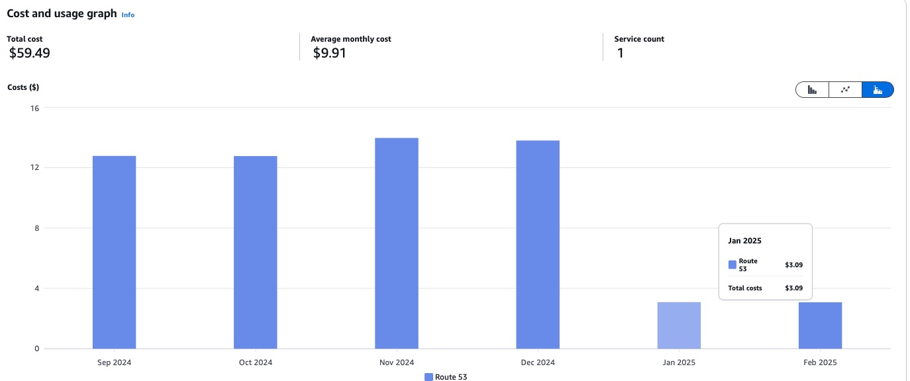

# RouteMaster

Zone delegation in Route53 cross-account is complicated. RouteMaster simplifies zone management in one account with fine-grained permissions for each zone and subdomain.

The clients that use shared zones will need to make more effort to work with those zones.

AWS designs constructs with a big assumption: zones are always local and are in the same account. That's why they added everywhere zone import methods. It makes it very convenient for clients to use it. On the flip side, it hides the legacy of managing zones delegation.

With RouteMaster, there is no need for DNS legacy sharing method with delegation. The clients update zone records directly and security with designed IAM role, designated per OU.

This is very scalable and cost-effective method to manage zones.


Change in Route53 cost after zones consolidation with RouteMaster

# How to use

In the account with consolidated Route53:

```ts
export class Route53Resources extends Stack {
  constructor(scope: Construct, id: string, props: BaseStackProps) {
    super(scope, id, props);

    // Enable RAM sharing - this is optional and may be already enabled in your org
    new SetRamShareWithAwsOrganization(this, "RamSharing");

    // Create reusable delegation set
    const set = new ReusableDelegationSet(this, "DelegationSet", {
      callerReference: "r53-set-1",
    });

    // Instantiate zone creator class, it needs AWS Organizations account id
    // and Organization ID and the AWS Organizations ID root (it's the same thing but different ids)
    const zoneCreator = new PublicHostedZoneWithReusableDelegationSet(
      this,
      "dnsmanagement",
      {
        orgAccountId: "243332259153",
        orgId: "o-4skejfwken",
        orgRootId: "6sw3",
        delegationSet: set,
        comment: "Managed by cdk, repo: cdk-root-hosted-zones",
      }
    );

    // Add new zones first
    const tldZones = [
      { domain: "acme.com", name: "acme" },
      { domain: "acme.ai", name: "acme-ai" }
      // ... many more
    ];

    // Define dev zones
    const devZones = [{ domain: "dev.acme.com", name: "dev-acme" }];

    // Create zones per domain
    zones.forEach((tldZones) => zoneCreator.addZone(zone.domain));

    // Share zones with OUs so the can add the records
    zones.forEach((tldZones) => zoneCreator.shareZoneWithRAM(zone.domain, orgIds));

    // Create IAM roles for the OUs which they will use to update records in specific zones
    zones.forEach((tldZones) =>
      zoneCreator.createRoute53Role(["shf24sfws"], [zone.domain])
    );

    // Note that for dev domains there is no need to create new zones
    // The dev records gets updated in respective TLD zone, but security with own IAM role shared to specific UOs
    devZones.forEach((zone) =>
      zoneCreator.createRoute53Role(["x81hd0je"], [zone.domain])
    );

    // Finally, after zone setup is ready - update name servers in Route53 registrar
    // Important! This will switch zones for the registered domains!
    // If you had zones provisioned in Route53, then make sure you migrated all records to zones managed with RouteMaster constructs.
    ["naumenko.ca", "acme.com", "acme.ai"].forEach(
      (domain) => zoneCreator.updateDomainNS(domain)
    );
  }
```

And in the app accounts:

```ts
import { CrossAccountRoute53RecordSet } from "cdk-cross-account-route53";

const domain = "acme.com";

// Get helper instantiated
const zoneHelper = new PublicHostedZoneClient(this, "helper", {
  accountId: "243332259153",
  domain: domain,
  region: "us-east-1",
});

// To updated records, it requires three components
// IHostedZone imported with `fromHostedZoneAttributes`
// IAM role to make changes
const zoneIdParam = zoneHelper.resolveHostedZoneId();

const zone = HostedZone.fromHostedZoneAttributes(this, "zone", {
  hostedZoneId: zoneIdParam.stringValue,
  zoneName: zoneHelper.processDomain(domain, true),
});

const validationRole: IRole = Role.fromRoleArn(
  this,
  "ValidationRole",
  zoneHelper.crossAccountRoleArn(),
);

// Create records, for example Google verification txt record
const record: ResourceRecordSet = {
  Name: props.domain + ".",
  Type: "TXT",
  ResourceRecords: [{ Value: props.googleVerificationToken }],
  TTL: 300,
};

new CrossAccountRoute53RecordSet(this, "GoogleVerification", {
  delegationRoleName: this.roleName,
  delegationRoleAccount: this.zoneAccountId,
  hostedZoneId,
  resourceRecordSets: [record],
});
```
